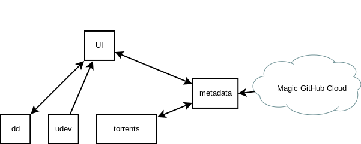

# Linux Freestyle

So far I feel the design is like this:



## The UI

The UI is currently written in QML.
Current ideas for it are:

1. It must be able to sort through distros by:
    - Date Added
    - Name
    - Flavor (Debian, RedHat, etc.)
    - Desktop (Gnome, KDE, MATE, etc.)
    - Specialty (Security, Privacy, Minimal, etc.)
    - Most Popular
    - Esoteric
2. It must support touch events
3. It must show progress information when flashing the USB
4. It must show indication that a USB is plugged in
5. It must display error conditions such as:
    - USB too small for ISO
    - USB ejected before flashing finished
6. It must warn user that USB data will be erased
7. Must keep track of which USBs are in use

## `dd`

This should be a small wrapper around `dd` that the UI
knows how to communicate to.
It should also be able to kick off many `dd` jobs and
report progress back to the UI.

## `udev`

This is another wrapper around `udev`.
It should:

1. Report when a USB (block device) is plugged in and unplugged
2. Report the capacity of said block device

## Torrents

Maybe as simple as running `transmissiond`.
This should:

1. Accept torrent files or magnet links
2. Torrrent / seed indefinitely
3. Report when a torrent has completed
4. Report the path of the downloaded ISO
5. Report the size of the ISO

## Metadata

This component will:

1. Be the database distro information for the UI
2. Poll the cloud for new distros
3. Send all distros to be torrented

## Magic GitHub Cloud

This will keep a list of distros, maybe in this format:

```JSON
[
    {
        "name": "kali",
        "version": "1.1.1",
        "label": "Kali Linux",
        "tags": {
            "flavor": "debian",
            "desktop": "gnome",
            "specialty": "security"
        }
    }
]
```

This will be on some GitHub repo or similar, as long
as there is an address that can be `curl`ed on the machine.

## Provisioning

Ideally it will be provisioned somehow, but this is a strech
goal, Puppet, Chef, etc.
Whatever is fine.

## Hardware

The machine will be roughly the size of a coke machine,
although much thinner from the current design.
It will be made out of wood and painted.
The touch screen will be bought, in the mean time I
(@illegalprime) have a broken laptop with a touch
screen we can use (after we take it apart to fix the
charging lol).

# Who's in Charge?

Who wants to take what? Please add your handles here:

| Feature| Lead|
|---|---|
| `dd` | @jgkamat |
| `ui` | @lotusronin |
| `torrenting` | @miningmarsh |
| `metadata` | @limvot |
| `udev` | @illegalprime |
| `provisioning` | @miningmarsh |

